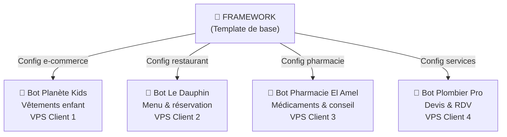
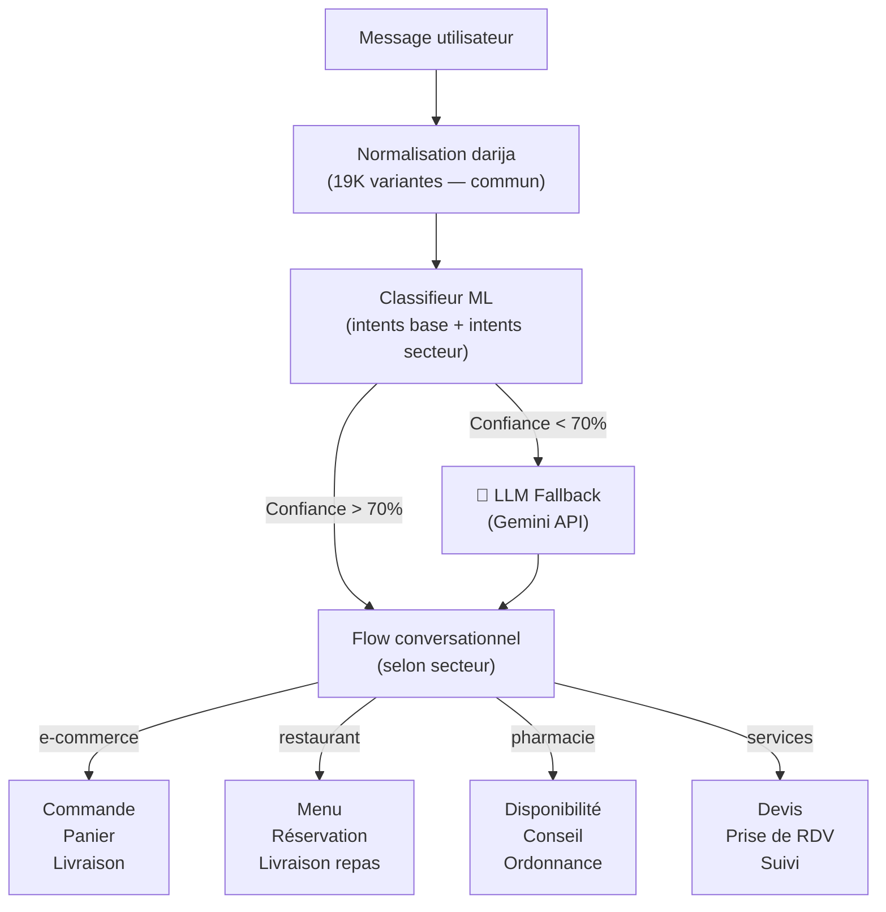
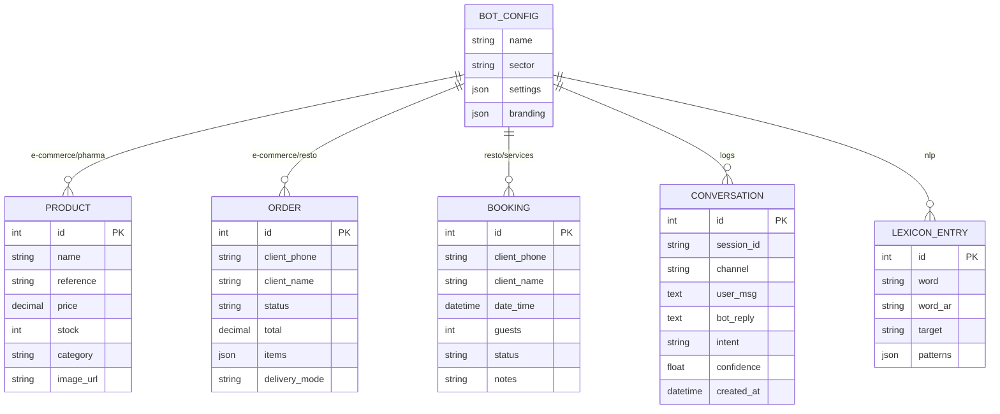
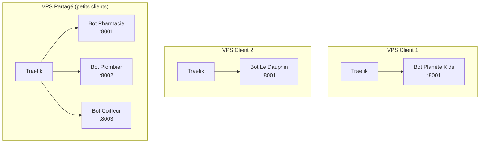

# 🏗️ ROADMAP — Framework Chatbot White-Label

> Un framework/template de bot qui se duplique et se personnalise pour chaque client selon son activité

---

## 📍 Concept : 1 client = 1 bot indépendant



**Principe :** Chaque bot est **totalement indépendant** — son propre serveur, sa propre base de données, son propre NLP, adapté à son métier.

---

## 🧅 Les 7 Couches du Framework

---

## 🎨 Couche 1 — DESIGN (UI/UX)

### Widget Chat personnalisable
- Couleurs, logo, position, messages d'accueil **par client**
- Thèmes prédéfinis par secteur d'activité
- Responsive mobile / desktop

### Dashboard Admin par bot
- Chaque client accède à **son propre** dashboard
- Gère son catalogue, conversations, stats, lexique

### Composants à designer

| Composant | Description | Priorité |
|---|---|---|
| **Widget Chat** | Bulle + fenêtre embeddable, thème selon activité | 🔴 P0 |
| **Dashboard Client** | Gestion catalogue, conversations, stats | 🔴 P0 |
| **Wizard de Config** | Configurer un nouveau bot en 5 étapes | 🟡 P1 |
| **Page Marketing** | Landing page pour vendre le service | 🟢 P2 |

### Outils
- **Figma** — Maquettes UI/UX
- **Shadcn/ui** — Composants réutilisables
- **Tailwind CSS v4** — Design system

---

## 🌐 Couche 2 — FRONTEND

### Architecture

```
framework/
├── widget/                  # Widget chat (vanilla JS)
│   ├── widget.js            # Script universel
│   ├── widget.css           # Styles isolés (shadow DOM)
│   └── themes/              # Thèmes par secteur
│       ├── ecommerce.css
│       ├── restaurant.css
│       ├── pharmacy.css
│       └── services.css
├── dashboard/               # Dashboard admin (Vue 3)
│   ├── pages/
│   │   ├── Login.vue
│   │   ├── Dashboard.vue    # KPI + stats
│   │   ├── Conversations.vue
│   │   ├── Catalogue.vue    # CRUD produits/services
│   │   ├── Lexique.vue      # Gestion NLP darija
│   │   ├── Settings.vue     # Config bot + branding
│   │   └── Analytics.vue
│   └── components/
│       └── ChatPreview.vue  # Aperçu widget en live
```

### Stack Frontend

| Technologie | Rôle | Pourquoi |
|---|---|---|
| **Vue 3 + Vite** | Dashboard admin | Déjà maîtrisé (Darlila) |
| **Vanilla JS** | Widget chat | Zéro dépendance, embed universel |
| **Tailwind CSS v4** | Styling | Rapide, responsive |
| **Pinia** | State management | Store réactif Vue 3 |
| **Chart.js** | Graphiques analytics | Léger, interactif |

### Widget embed
```html
<!-- Le client colle ça sur son site -->
<script src="https://cdn.br-solution.tech/widget.js"
  data-bot-url="https://bot-planetekids.br-solution.tech"
  data-color="#FF6B35"
  data-name="Planète Kids"
  data-welcome="Bienvenue ! Comment puis-je vous aider ?">
</script>
```

---

## ⚙️ Couche 3 — BACKEND API

### Architecture template (dupliqué par client)

```
bot-template/
├── app/
│   ├── core/
│   │   ├── config.py            # ⚙️ Config du bot (nom, secteur, horaires)
│   │   ├── database.py          # Base de données
│   │   └── auth.py              # Auth admin (JWT)
│   ├── chat/
│   │   ├── web_chat.py          # Moteur chat web
│   │   ├── whatsapp.py          # WhatsApp handler
│   │   ├── flows/               # 🔑 Flows conversationnels par ACTIVITÉ
│   │   │   ├── ecommerce.py     # Commande, panier, livraison
│   │   │   ├── restaurant.py    # Menu, réservation, livraison repas
│   │   │   ├── pharmacy.py      # Conseil santé, disponibilité médicament
│   │   │   ├── services.py      # Devis, prise de RDV
│   │   │   └── base.py          # Flow commun (salutations, horaires, contact)
│   │   └── router.py
│   ├── nlp/
│   │   ├── classifier.py        # Classifieur ML
│   │   ├── normalizer.py        # Normalisation darija
│   │   └── lexicon.py           # Lexique admin
│   ├── catalog/
│   │   ├── search.py            # Recherche intelligente
│   │   └── import_export.py     # Import Excel/CSV
│   ├── orders/                  # Module commande (e-commerce / resto)
│   ├── booking/                 # Module RDV (services / médical)
│   └── main.py                  # FastAPI app
├── data/
│   ├── intents/                 # 🔑 Intents par ACTIVITÉ
│   │   ├── base.yaml            # Intents communs (greeting, hours, etc.)
│   │   ├── ecommerce.yaml       # Intents e-commerce (commande, livraison)
│   │   ├── restaurant.yaml      # Intents resto (menu, réservation)
│   │   ├── pharmacy.yaml        # Intents pharmacie
│   │   └── services.yaml        # Intents services (devis, RDV)
│   ├── darija/                  # 🔑 Lexique darija par DOMAINE
│   │   ├── darija_variants.json # Dictionnaire orthographe (commun)
│   │   ├── ecommerce.csv        # Mots darija e-commerce
│   │   ├── food.csv             # Mots darija alimentation/resto
│   │   ├── health.csv           # Mots darija santé/pharmacie
│   │   └── general.csv          # Mots darija généraux
│   ├── responses.yaml           # Réponses personnalisées du client
│   └── bot.yaml                 # 🔑 CONFIG PRINCIPALE DU BOT
├── Dockerfile
├── docker-compose.yml
└── setup.sh                     # Script de déploiement automatique
```

### Fichier `bot.yaml` — Le cœur de la personnalisation

```yaml
# Chaque bot a sa propre config
bot:
  name: "Planète Kids"
  sector: "ecommerce"          # ecommerce | restaurant | pharmacy | services
  language: ["fr", "darija"]
  timezone: "Africa/Algiers"

business:
  phone: "+213 555 123 456"
  address: "Rue Didouche Mourad, Alger"
  hours:
    mon-sat: "09:00-19:00"
    sun: "fermé"
  delivery:
    zones: ["Alger", "Blida", "Tipaza"]
    companies: ["Yalidine", "ZR Express"]
  payment: ["CCP", "BaridiMob", "Edahabia", "espèces"]

widget:
  color: "#FF6B35"
  position: "bottom-right"
  welcome: "Bienvenue chez Planète Kids ! 👋"
  logo: "/assets/logo.png"

nlp:
  intents_files:
    - "data/intents/base.yaml"
    - "data/intents/ecommerce.yaml"
  darija_files:
    - "data/darija/general.csv"
    - "data/darija/ecommerce.csv"
  flow: "ecommerce"             # Quel flow conversationnel utiliser
```

### Stack Backend

| Technologie | Rôle | Pourquoi |
|---|---|---|
| **FastAPI** | Framework API | Rapide, async, auto-docs |
| **Uvicorn + Gunicorn** | Serveur multi-workers | Performance |
| **SQLAlchemy 2.0** | ORM | Async, migrations |
| **Alembic** | Migrations DB | Versioning schéma |
| **Pydantic v2** | Validation | Schemas API |
| **python-jose** | JWT Auth | Tokens admin |
| **Celery + Redis** | Tâches async | Ré-entraînement NLP, imports |

---

## 🧠 Couche 4 — NLP / Intelligence Artificielle

### Architecture NLP modulaire



### Intents par secteur d'activité

| Secteur | Intents spécifiques | Exemples darija |
|---|---|---|
| **E-commerce** | commande, panier, livraison, taille, couleur, promo | "bghit nekmandi", "chhal taousil" |
| **Restaurant** | menu, réservation, plat du jour, allergènes, livraison repas | "wach kayen pizza", "bghit table l 8" |
| **Pharmacie** | disponibilité médicament, conseil, ordonnance, garde | "wach kayen doliprane", "pharmacie de garde" |
| **Services** | devis, RDV, tarif, zone d'intervention, urgence | "bghit devis", "tekdrou tjiw l Blida?" |

### Stack NLP / IA

| Technologie | Rôle | Pourquoi |
|---|---|---|
| **scikit-learn** | Classification ML | Léger, efficace, pas de GPU |
| **TF-IDF + LogReg** | Vectorisation + classification | Rapide |
| **joblib** | Sérialisation modèle | Sauvegarder modèles entraînés |
| **Google Gemini API** | LLM fallback intelligent | Quand le ML ne trouve pas |
| **FAISS** | Recherche vectorielle | Recherche sémantique catalogue |
| **spaCy** | NLP avancé (futur) | NER, extraction d'entités |

---

## 💾 Couche 5 — DATA

### Base de données (1 DB par bot)

Chaque bot a **sa propre base** — aucun partage de données entre clients.

| Actuel (Phase 1) | Cible (Phase 2) |
|---|---|
| SQLite (simple, 1 fichier) | PostgreSQL (robuste, concurrent) |
| OK pour démarrer | Nécessaire quand le bot a du trafic |

### Schéma commun (adapté par secteur)



### Stack Data

| Technologie | Rôle |
|---|---|
| **SQLite** | Phase 1 — simple, 1 fichier, facile à déployer |
| **PostgreSQL 16** | Phase 2 — quand le bot a du trafic |
| **Redis 7** | Cache, sessions chat, rate limiting |
| **MinIO / S3** | Stockage images produits |

---

## 🚀 Couche 6 — INFRASTRUCTURE

### Déploiement : 1 bot = 1 container Docker



> **Flexibilité :** un gros client = son propre VPS. Plusieurs petits clients = VPS partagé avec des containers isolés.

### Script de déploiement automatique

```bash
# setup.sh — Déployer un nouveau bot en 3 commandes
./setup.sh init "Bot Le Dauphin" restaurant
./setup.sh import-catalog menu.xlsx
./setup.sh deploy bot-ledauphin.br-solution.tech
```

### Stack Infrastructure

| Technologie | Rôle |
|---|---|
| **Docker** | Containerisation (1 container par bot) |
| **Docker Compose** | Orchestration locale + petits déploiements |
| **Coolify** | Déploiement via git push (déjà maîtrisé) |
| **Traefik** | Reverse proxy + SSL auto |
| **GitHub Actions** | CI/CD — build + test + deploy |
| **Cloudflare** | CDN + DNS + WAF |
| **Let's Encrypt** | Certificats SSL gratuits |
| **Sentry** | Monitoring erreurs |

---

## 🔒 Couche 7 — SÉCURITÉ

| Composant | Mécanisme |
|---|---|
| **Auth Dashboard** | JWT + mot de passe hashé (bcrypt) |
| **Isolation** | Chaque bot = sa propre DB + son propre container |
| **Rate limiting** | 60 req/min par IP |
| **CORS** | Whitelist du domaine du client uniquement |
| **SSL** | TLS 1.3 via Let's Encrypt |
| **Input sanitization** | Pydantic validation + bleach |
| **Données** | Aucun partage entre bots — isolation totale |

### Stack Sécurité

| Technologie | Rôle |
|---|---|
| **python-jose** | JWT tokens |
| **passlib + bcrypt** | Hash mots de passe |
| **slowapi** | Rate limiting |
| **bleach** | Sanitisation HTML |

---

## 📅 ROADMAP — 6 Étapes pas à pas

### Étape 1 — Template de base (2 semaines)
> Extraire un template réutilisable du bot Planète Kids

```
□ Créer le fichier bot.yaml (config centralisée)
□ Séparer intents en base.yaml + ecommerce.yaml
□ Créer le système de flows (base.py + ecommerce.py)
□ Externaliser toutes les réponses dans responses.yaml
□ Rendre le branding dynamique (nom, couleurs, messages)
□ Script setup.sh pour initialiser un nouveau bot
□ Gunicorn multi-workers
□ Documenter le processus de duplication
```

**Résultat :** Dupliquer un bot pour un nouveau client e-commerce en 30 minutes.

---

### Étape 2 — Dashboard Admin (2-3 semaines)
> Chaque client gère son bot via une interface web

```
□ Vue 3 + Vite + Tailwind dashboard
□ Login JWT (1 admin par bot)
□ Page Catalogue (import Excel + CRUD)
□ Page Lexique (ajouter/modifier mots darija)
□ Page Conversations (journal temps réel)
□ Page Stats (graphiques messages/jour, top intents)
□ Page Settings (branding, messages, horaires)
□ Preview widget en live
```

**Résultat :** Le client est autonome pour gérer son bot.

---

### Étape 3 — Widget Universel (1-2 semaines)
> Un script JS personnalisable que le client colle sur son site

```
□ Widget vanilla JS (shadow DOM, 0 dépendance)
□ Personnalisation par data-attributes (couleur, logo, position)
□ Thèmes par secteur (e-commerce, resto, pharmacie)
□ Responsive mobile/desktop
□ Indicateur "en ligne" + "typing..."
□ Historique conversation (localStorage)
□ CDN Cloudflare
```

**Résultat :** `<script src="..." data-bot-url="...">` et ça marche sur n'importe quel site.

---

### Étape 4 — Flows par activité (3-4 semaines)
> Adapter le bot à chaque métier

```
□ Flow RESTAURANT :
    - Afficher le menu du jour
    - Réservation de table (date, heure, nombre)
    - Commande livraison repas
    - Allergènes et ingrédients
    - Intents darija spécifiques ("wach kayen pizza", "table l 8")
    - Lexique darija alimentaire

□ Flow PHARMACIE :
    - Recherche médicament par nom
    - Disponibilité en stock
    - Conseil santé basique
    - Pharmacie de garde
    - Intents darija santé ("wach kayen doliprane")
    - Lexique darija médical

□ Flow SERVICES (plombier, électricien, coiffeur...) :
    - Demande de devis
    - Prise de RDV (calendrier)
    - Zone d'intervention
    - Tarification
    - Intents darija services ("bghit devis", "tekdrou tjiw?")
```

**Résultat :** Le framework couvre les 4 secteurs principaux en Algérie.

---

### Étape 5 — LLM Intelligence (2-3 semaines)
> Quand le ML classique ne comprend pas → Gemini prend le relais

```
□ Intégration Google Gemini API
□ Prompt templates par secteur :
    - E-commerce : "Tu es un vendeur de {nom_magasin}..."
    - Restaurant : "Tu es l'assistant du restaurant {nom}..."
    - Pharmacie : "Tu es l'assistant de la pharmacie {nom}..."
□ RAG avec catalogue (FAISS + embeddings)
□ Apprentissage : conversations non-résolues → suggestions
□ Analyse de sentiment
```

**Résultat :** Le bot répond intelligemment à toute question, même imprévue.

---

### Étape 6 — Automatisation + Scale (2-3 semaines)
> Déployer un nouveau bot en 5 minutes

```
□ CLI de déploiement :
    $ botctl new "Le Dauphin" --sector restaurant --vps 187.x.x.x
    $ botctl import-catalog menu.xlsx
    $ botctl deploy
□ Template Docker Compose par secteur
□ Script d'import catalogue intelligent (détecte les colonnes)
□ Monitoring centralisé (tous vos bots sur 1 dashboard)
□ Alertes (bot down, erreurs NLP, messages non-résolus)
□ Backup automatique des DB clients
```

**Résultat :** Créer et déployer un bot pour un nouveau client en 5 minutes.

---

## 📦 Stack complète résumée

| Couche | Technologies |
|---|---|
| **Frontend Widget** | Vanilla JS, Shadow DOM, CSS Variables, thèmes par secteur |
| **Frontend Dashboard** | Vue 3, Vite, Tailwind CSS v4, Pinia, Chart.js |
| **Backend API** | FastAPI, Gunicorn, Uvicorn, Pydantic v2, SQLAlchemy 2.0 |
| **NLP / IA** | scikit-learn, TF-IDF, Google Gemini, FAISS |
| **Base de données** | SQLite (démarrage) → PostgreSQL (scale), Redis |
| **Tâches async** | Celery, Redis (broker) |
| **Infrastructure** | Docker, Docker Compose, Coolify, Traefik, GitHub Actions |
| **Monitoring** | Sentry |
| **Sécurité** | JWT, bcrypt, slowapi, CORS, TLS 1.3 |
| **CDN / DNS** | Cloudflare |
| **Stockage** | MinIO / S3 (images) |

---

## 💰 Modèle commercial

| Formule | Prix/mois | Inclus |
|---|---|---|
| **Starter** | 5 000 DZD | Widget web, 500 msg/mois, 100 produits |
| **Pro** | 15 000 DZD | + WhatsApp, 5000 msg/mois, 1000 produits, dashboard |
| **Business** | 30 000 DZD | + LLM Gemini, illimité, analytics, support prioritaire |

**Frais de setup :** 20 000 — 50 000 DZD (config initiale + import catalogue)

---

## 🎯 Ce qui existe DÉJÀ dans le framework

| Composant | Statut | Détail |
|---|---|---|
| Moteur NLP | ✅ Prêt | 157 intents, 25K patterns, normalisation 19K variantes |
| Lexique darija | ✅ Prêt | CRUD admin, ré-entraînement async |
| Recherche produits | ✅ Prêt | SQLite, fuzzy search, multi-critères |
| Système commande | ✅ Prêt | Panier, calcul prix, livraison |
| Journal conversations | ✅ Prêt | SQLite, stats, cleanup auto |
| Widget web | ✅ Basique | Fonctionne, à améliorer (thèmes) |
| WhatsApp | ✅ Prêt | Meta Business API |
| Docker | ✅ Prêt | Dockerfile, Coolify deploy |
| Darija NLP | ✅ Prêt | 4 langues (MSA, Derja, Arabizi, FR) |

---

*Roadmap v2.0 — 08/10/2026 — Architecture : 1 client = 1 bot indépendant*
