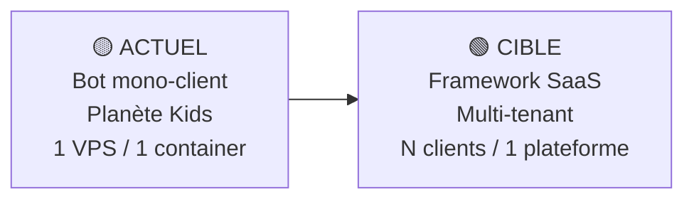
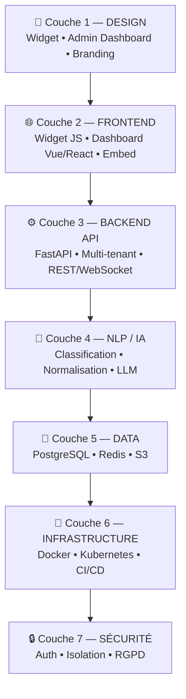
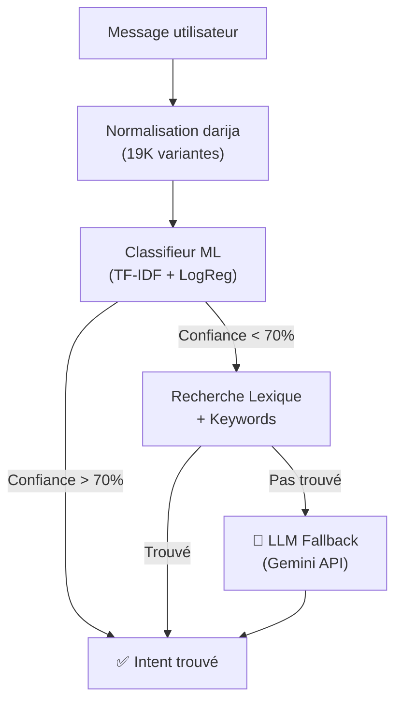
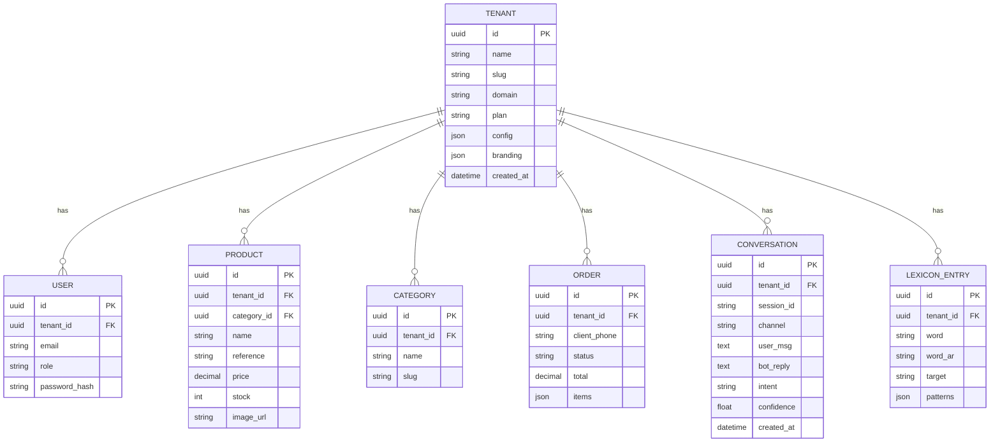
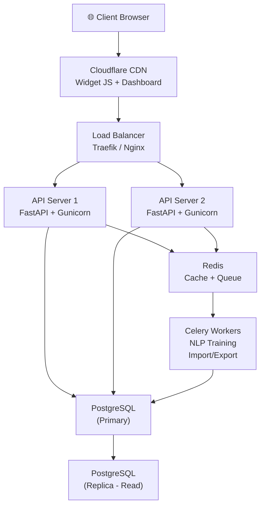

# 🏗️ ROADMAP — Chatbot Framework Multi-Tenant SaaS

> Transformer le bot Planète Kids en framework réutilisable pour tous vos futurs clients

---

## 📍 État actuel vs Cible



| Dimension | Actuel (mono-client) | Cible (framework SaaS) |
|---|---|---|
| **Clients** | 1 (Planète Kids) | N clients, chacun avec son bot |
| **Déploiement** | 1 VPS + 1 container Docker | 1 plateforme, N tenants isolés |
| **Admin** | Token hardcodé | Dashboard multi-client avec auth |
| **NLP** | 1 intents.yaml partagé | Base commune + intents par client |
| **Catalogue** | 1 SQLite par client | PostgreSQL multi-tenant |
| **Widget** | PHP proxy sur Hostinger | Widget JS universel (CDN) |
| **Facturation** | Aucune | Abonnements + quotas |

---

## 🧅 Les 7 Couches du Framework



---

## 🎨 Couche 1 — DESIGN (UI/UX)

### État actuel
- Widget chat basique (HTML inline dans `page.html`)
- Admin lexique : page HTML simple
- Pas de dashboard client
- Branding hardcodé "Planète Kids"

### Cible
- Widget **personnalisable** (couleurs, logo, position, messages d'accueil)
- **Dashboard admin** complet par client
- **Super-admin** pour vous (gérer tous les clients)
- Branding **dynamique** par tenant

### Composants à designer

| Composant | Description | Priorité |
|---|---|---|
| **Widget Chat** | Bulle + fenêtre de chat embeddable sur n'importe quel site | 🔴 P0 |
| **Dashboard Client** | Gestion catalogue, lexique, conversations, stats | 🔴 P0 |
| **Super-Admin** | Créer/gérer les tenants, quotas, facturation | 🟡 P1 |
| **Onboarding Wizard** | Configurer un nouveau client en 5 étapes | 🟡 P1 |
| **Page Marketing** | Landing page pour vendre le service | 🟢 P2 |

### Outils de design
- **Figma** — Maquettes UI/UX
- **Shadcn/ui** — Composants réutilisables
- **Tailwind CSS v4** — Design system

---

## 🌐 Couche 2 — FRONTEND

### Architecture cible

```
frontend/
├── widget/              # Widget chat embeddable (vanilla JS)
│   ├── widget.js        # Script universel <script src="...">
│   ├── widget.css       # Styles isolés (shadow DOM)
│   └── config.js        # Personnalisation par tenant
├── dashboard/           # Dashboard admin (Vue 3 / React)
│   ├── pages/
│   │   ├── Login.vue
│   │   ├── Dashboard.vue       # KPI + stats
│   │   ├── Conversations.vue   # Journal en temps réel
│   │   ├── Catalogue.vue       # CRUD produits
│   │   ├── Lexique.vue         # Gestion NLP darija
│   │   ├── Settings.vue        # Config bot + branding
│   │   └── Analytics.vue       # Graphiques + export
│   └── components/
│       ├── ChatPreview.vue     # Aperçu widget en live
│       └── StatsCards.vue
└── superadmin/          # Panel super-admin
    ├── Tenants.vue      # Liste clients
    ├── Billing.vue      # Facturation
    └── System.vue       # Monitoring
```

### Stack Frontend

| Technologie | Rôle | Pourquoi |
|---|---|---|
| **Vue 3 + Vite** | Dashboard admin | Vous avez déjà le frontend-vue de Darlila |
| **Vanilla JS** | Widget chat | Zéro dépendance, embed universel |
| **Tailwind CSS v4** | Styling | Rapide, responsive, design system |
| **Pinia** | State management | Store réactif pour Vue 3 |
| **Chart.js** | Graphiques analytics | Léger, joli, interactif |
| **Socket.IO client** | Chat temps réel | WebSocket pour conversations live |

### Widget universel (embed)
```html
<!-- Le client colle ça sur son site -->
<script
  src="https://bot.br-solution.tech/widget.js"
  data-tenant="planet-kids"
  data-color="#FF6B35"
  data-position="bottom-right">
</script>
```

---

## ⚙️ Couche 3 — BACKEND API

### Architecture cible

```
app/
├── core/                    # Noyau framework
│   ├── config.py            # Settings multi-tenant
│   ├── database.py          # PostgreSQL + connexion pool
│   ├── auth.py              # JWT + API keys
│   ├── middleware.py        # Tenant detection middleware
│   └── exceptions.py       # Error handlers
├── tenants/                 # Gestion multi-tenant
│   ├── models.py            # Tenant, Plan, Quota
│   ├── router.py            # CRUD tenants (super-admin)
│   └── service.py           # Logique métier
├── chat/                    # Moteur de chat
│   ├── web_chat.py          # Chat web (existant, adapté)
│   ├── whatsapp.py          # WhatsApp handler
│   ├── instagram.py         # 🔮 Futur : Instagram DM
│   ├── messenger.py         # 🔮 Futur : Facebook Messenger
│   └── router.py            # Routes /chat/*
├── nlp/                     # Intelligence NLP
│   ├── classifier.py        # Classifieur ML (existant)
│   ├── normalizer.py        # Normalisation darija (existant)
│   ├── lexicon.py           # Lexique admin (existant)
│   └── router.py            # API /nlp/*
├── catalog/                 # Catalogue produits
│   ├── models.py            # Product, Category, Price
│   ├── search.py            # Recherche intelligente
│   ├── import_export.py     # Import Excel/CSV
│   └── router.py            # API /catalog/*
├── orders/                  # Commandes
│   ├── models.py            # Order, OrderItem
│   ├── flow.py              # Machine à états commande
│   └── router.py            # API /orders/*
├── analytics/               # Statistiques
│   ├── models.py            # ConversationLog, Metric
│   ├── aggregator.py        # Calculs KPI
│   └── router.py            # API /analytics/*
├── integrations/            # Intégrations externes
│   ├── whatsapp_api.py      # Meta Business API
│   ├── payment.py           # BaridiMob, CCP, Stripe
│   └── delivery.py          # Yalidine, ZR Express
└── main.py                  # FastAPI app factory
```

### Stack Backend

| Technologie | Rôle | Pourquoi |
|---|---|---|
| **FastAPI** | Framework API | Déjà utilisé, rapide, async, auto-docs |
| **Uvicorn + Gunicorn** | Serveur | Multi-workers (plus de single worker) |
| **SQLAlchemy 2.0** | ORM | Async, type-safe, migrations |
| **Alembic** | Migrations DB | Versioning de schéma |
| **Pydantic v2** | Validation | Déjà utilisé, schemas API |
| **python-jose** | JWT Auth | Tokens sécurisés |
| **Celery + Redis** | Tâches async | Ré-entraînement NLP, imports, emails |
| **WebSocket** | Chat temps réel | Conversations live dans dashboard |

### Middleware Multi-Tenant
```python
# Chaque requête identifie le tenant automatiquement
@app.middleware("http")
async def tenant_middleware(request, call_next):
    tenant_id = request.headers.get("X-Tenant-ID")
    # ou depuis le sous-domaine: planet-kids.bot.br-solution.tech
    # ou depuis l'API key
    request.state.tenant = await get_tenant(tenant_id)
    return await call_next(request)
```

---

## 🧠 Couche 4 — NLP / Intelligence Artificielle

### Architecture cible

```
nlp/
├── base/                    # Modèle de base partagé
│   ├── intents_base.yaml    # Intents communs (greeting, payment, delivery...)
│   ├── darija_variants.json # Dictionnaire orthographe (partagé)
│   └── normalizer.py       # Normalisation (partagé)
├── tenants/                 # Données NLP par client
│   ├── {tenant_id}/
│   │   ├── intents.yaml     # Intents spécifiques au client
│   │   ├── lexicon.yaml     # Lexique darija du client
│   │   ├── responses.yaml   # Réponses personnalisées
│   │   └── model.joblib     # Modèle ML entraîné
├── engine/
│   ├── classifier.py        # TF-IDF + LogReg (existant)
│   ├── intent_merger.py     # Fusionne base + tenant intents
│   ├── trainer.py           # Entraînement async par tenant
│   └── evaluator.py         # Précision / métriques NLP
└── llm/                     # 🔮 Futur : LLM fallback
    ├── gemini_adapter.py    # Google Gemini API
    ├── prompt_templates.py  # Prompts par domaine
    └── rag.py               # Retrieval Augmented Generation
```

### Stack NLP / IA

| Technologie | Rôle | Pourquoi |
|---|---|---|
| **scikit-learn** | Classification ML | Déjà utilisé, léger, efficace pour 25K patterns |
| **TF-IDF + LogReg** | Vectorisation + classification | Rapide, pas besoin de GPU |
| **joblib** | Sérialisation modèle | Sauvegarder/charger modèles entraînés |
| **Google Gemini API** | LLM fallback intelligent | Quand le ML classique ne trouve pas |
| **LangChain** | Orchestration LLM | RAG, chaînes, mémoire conversationnelle |
| **FAISS** | Recherche vectorielle | Recherche sémantique dans le catalogue |
| **spaCy** | NLP avancé (futur) | NER, POS tagging, lemmatisation |

### Stratégie NLP à 3 niveaux



---

## 💾 Couche 5 — DATA

### Migration SQLite → PostgreSQL

| Actuel (SQLite) | Cible (PostgreSQL) | Pourquoi |
|---|---|---|
| 1 fichier `orders.db` | PostgreSQL multi-tenant | Concurrent, fiable, scalable |
| Pas de migrations | Alembic migrations | Versioning de schéma |
| Pas d'isolation | Schema par tenant ou `tenant_id` | Isolation des données |
| Pas de cache | Redis cache | Sessions, quotas, rate limiting |
| Images en URL | S3/MinIO | Stockage fichiers scalable |

### Schéma base de données



### Stack Data

| Technologie | Rôle | Pourquoi |
|---|---|---|
| **PostgreSQL 16** | Base principale | ACID, JSON, full-text search, fiable |
| **Redis 7** | Cache + sessions + queues | Rate limiting, sessions chat, pub/sub |
| **MinIO / S3** | Stockage fichiers | Images produits, exports Excel |
| **Alembic** | Migrations | Versioning schéma DB |
| **pgvector** | Vecteurs (futur) | Recherche sémantique avec embeddings |

---

## 🚀 Couche 6 — INFRASTRUCTURE

### Architecture de déploiement



### Stack Infrastructure

| Technologie | Rôle | Pourquoi |
|---|---|---|
| **Docker** | Containerisation | Déjà utilisé, reproductible |
| **Docker Compose** | Orchestration locale | Dev + staging |
| **Coolify / Kubernetes** | Orchestration production | Auto-scaling, self-healing |
| **Traefik** | Reverse proxy + SSL | Déjà utilisé, routing dynamique |
| **GitHub Actions** | CI/CD | Build + test + deploy automatique |
| **Cloudflare** | CDN + DNS + WAF | Performance + sécurité |
| **Let's Encrypt** | SSL | Certificats gratuits auto-renouvelés |
| **Sentry** | Error tracking | Monitoring erreurs en production |
| **Prometheus + Grafana** | Monitoring | Métriques système + business |

### Docker Compose Production
```yaml
services:
  api:
    build: .
    command: gunicorn app.main:app -w 4 -k uvicorn.workers.UvicornWorker
    deploy:
      replicas: 2
    depends_on: [postgres, redis]

  worker:
    build: .
    command: celery -A app.tasks worker --loglevel=info
    depends_on: [postgres, redis]

  postgres:
    image: postgres:16-alpine
    volumes: [pgdata:/var/lib/postgresql/data]

  redis:
    image: redis:7-alpine

  traefik:
    image: traefik:v3.0
    ports: ["80:80", "443:443"]
```

---

## 🔒 Couche 7 — SÉCURITÉ

### Modèle de sécurité

| Composant | Mécanisme | Détail |
|---|---|---|
| **Auth Dashboard** | JWT + Refresh tokens | Login email/password, tokens expirables |
| **Auth API** | API Key par tenant | Header `X-API-Key` pour le widget |
| **Auth Super-Admin** | JWT + 2FA (TOTP) | Double authentification |
| **Isolation données** | `tenant_id` sur chaque table | Un client ne voit JAMAIS les données d'un autre |
| **Rate limiting** | Redis + middleware | 60 req/min par IP, 1000/jour par tenant |
| **RGPD** | Anonymisation + export + suppression | Droit à l'oubli, export données |
| **Chiffrement** | TLS 1.3 + bcrypt passwords | En transit + au repos |
| **CORS** | Whitelist par tenant | Chaque client autorise son domaine |
| **Input sanitization** | Pydantic + bleach | Prévention XSS/injection |

### Stack Sécurité

| Technologie | Rôle |
|---|---|
| **python-jose** | JWT tokens |
| **passlib + bcrypt** | Hash mots de passe |
| **pyotp** | 2FA TOTP |
| **slowapi** | Rate limiting FastAPI |
| **bleach** | Sanitisation HTML |

---

## 📅 ROADMAP — 6 Étapes (pas à pas)

### Étape 1 — Multi-Tenant Core (2-3 semaines)
> Transformer le mono-client en multi-tenant

```
□ Migrer SQLite → PostgreSQL (Alembic)
□ Ajouter table tenants + tenant_id partout
□ Middleware tenant detection
□ Config par tenant (branding, messages, horaires)
□ API Key auth pour chaque tenant
□ Séparer intents_base.yaml + intents par tenant
□ Gunicorn multi-workers (fini le single worker)
```

**Résultat :** Le même code sert N clients avec leurs données isolées.

---

### Étape 2 — Dashboard Admin Client (2-3 semaines)
> Chaque client gère son bot via une interface web

```
□ Vue 3 + Vite + Tailwind dashboard
□ Login JWT avec rôles (admin, viewer)
□ Page Catalogue (import Excel + CRUD produits)
□ Page Lexique (ajouter/modifier mots darija)
□ Page Conversations (journal en temps réel)
□ Page Stats (graphiques messages/jour, top intents)
□ Page Settings (branding, messages, horaires)
□ Preview widget en live
```

**Résultat :** Le client est autonome, il gère tout sans vous appeler.

---

### Étape 3 — Widget Chat Universel (1-2 semaines)
> Un script JS que le client colle sur son site

```
□ Widget vanilla JS (shadow DOM, 0 dépendance)
□ Personnalisation dynamique (couleur, logo, position, langue)
□ Responsive mobile/desktop
□ Indicateur "en ligne" + "typing..."
□ Historique conversation (localStorage)
□ Bouton WhatsApp intégré
□ CDN Cloudflare pour le script
```

**Résultat :** `<script src="..." data-tenant="xxx">` et ça marche.

---

### Étape 4 — Super-Admin + Onboarding (1-2 semaines)
> Votre panel pour gérer tous les clients

```
□ Panel super-admin (Vue 3)
□ CRUD tenants (créer, suspendre, supprimer)
□ Wizard onboarding en 5 étapes :
    1. Nom du magasin + domaine
    2. Upload catalogue Excel
    3. Personnalisation widget (couleurs, logo)
    4. Génération API Key
    5. Code embed à copier
□ Quotas par plan (messages/mois, produits max)
□ Monitoring santé de chaque bot
```

**Résultat :** Créer un nouveau client en 5 minutes.

---

### Étape 5 — LLM Fallback + Intelligence (2-3 semaines)
> Quand le ML classique ne comprend pas → Gemini prend le relais

```
□ Intégration Google Gemini API
□ Prompt templates par domaine (e-commerce, resto, pharmacie...)
□ RAG avec catalogue produits (FAISS + embeddings)
□ Apprentissage continu (conversations non-résolues → suggestions)
□ Analyse de sentiment
□ Résumé automatique des conversations
□ Suggestions de réponses pour l'humain (handover)
```

**Résultat :** Le bot répond intelligemment à tout, même les questions imprévues.

---

### Étape 6 — Monétisation + Scale (2-3 semaines)
> Transformer en business rentable

```
□ Plans tarifaires (Free, Pro, Business)
□ Système de facturation (Stripe ou CCP/BaridiMob)
□ Limites par plan :
    Free:     500 msg/mois, 100 produits
    Pro:      5000 msg/mois, 1000 produits, widget custom
    Business: illimité, WhatsApp, analytics, API
□ Page marketing / landing page
□ Documentation API (Swagger auto + guide d'intégration)
□ Multi-canal : Instagram DM, Facebook Messenger
□ Kubernetes pour auto-scaling
```

**Résultat :** Un SaaS qui génère des revenus récurrents.

---

## 📦 Stack complète résumée

| Couche | Technologies |
|---|---|
| **Frontend Widget** | Vanilla JS, Shadow DOM, CSS Variables |
| **Frontend Dashboard** | Vue 3, Vite, Tailwind CSS v4, Pinia, Chart.js |
| **Backend API** | FastAPI, Gunicorn, Uvicorn, Pydantic v2 |
| **NLP / IA** | scikit-learn, TF-IDF, Google Gemini, LangChain, FAISS |
| **Base de données** | PostgreSQL 16, SQLAlchemy 2.0, Alembic, Redis 7 |
| **Tâches async** | Celery, Redis (broker) |
| **Infrastructure** | Docker, Docker Compose, Coolify/K8s, Traefik, GitHub Actions |
| **Monitoring** | Sentry, Prometheus, Grafana |
| **Sécurité** | JWT, bcrypt, TOTP 2FA, slowapi, CORS |
| **CDN / DNS** | Cloudflare |
| **Stockage** | MinIO / S3 |
| **Paiement** | Stripe, BaridiMob, CCP |

---

## 🎯 Quick Wins (ce que vous pouvez vendre MAINTENANT)

Même sans tout développer, vous pouvez déjà vendre le bot actuel à d'autres clients en :

1. **Dupliquant le VPS** pour chaque client (1 container par client)
2. **Changeant** `responses.py` (nom du magasin, horaires, adresse)
3. **Important** le catalogue Excel du client
4. **Personnalisant** le widget (couleurs, logo)

> 💡 C'est la méthode "artisanale" en attendant le framework automatisé.

---

*Roadmap v1.0 — 08/10/2026*
